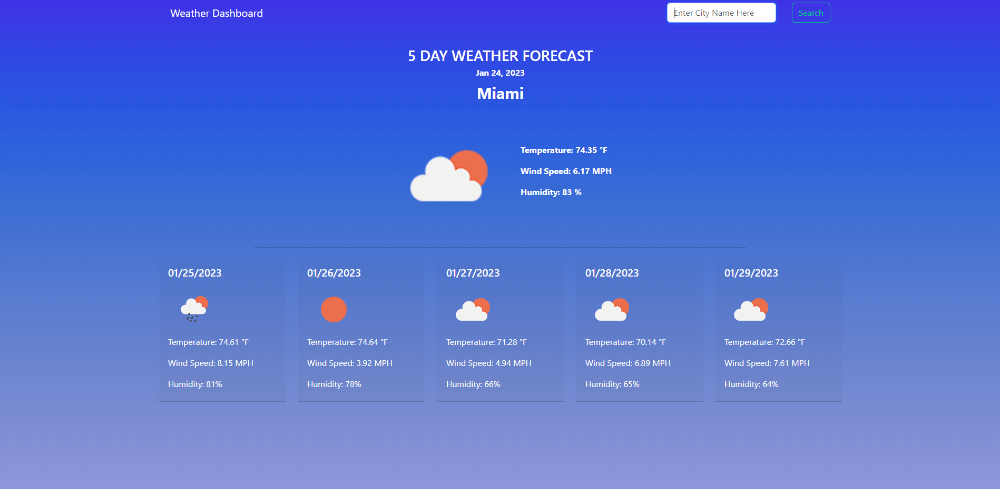

# 06 Weather Dashboard (Module 6 Challenge)

## Description

A simple weather dashboard that allows a user to see the current weather + five day forecast for any city input. This weather dashboard will show current/upcoming temperature, conditions, humidity, and wind speed, as well as track previous city searches.

Check out the webapge: https://ohNOitsRo.github.io/weather-dashboard

## Table of Contents

- [Installation](#installation)
- [Usage](#usage)
- [Credits](#credits)
- [License](#license)

## Installation

N/A

## Usage

Preview of website layout and design.

## Credits

OpenWeatherMap for their API access.
https://openweathermap.org/

Bootstrap for some beautiful designs.
https://getbootstrap.com/

jQuery for some functionality.
https://jquery.com/

## License

Please refer to the LICENSE in the repo.

---